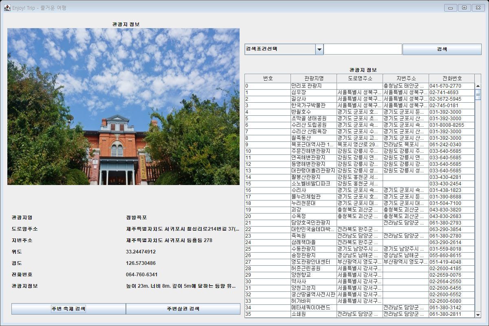
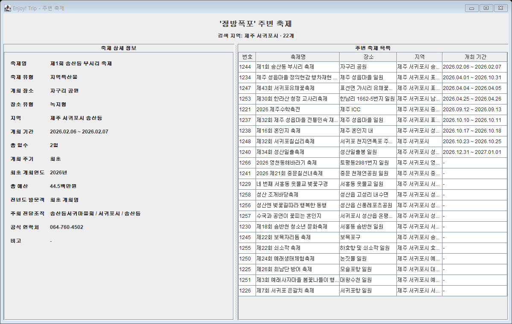
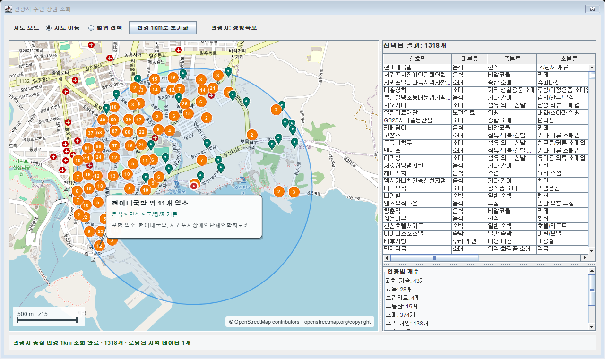
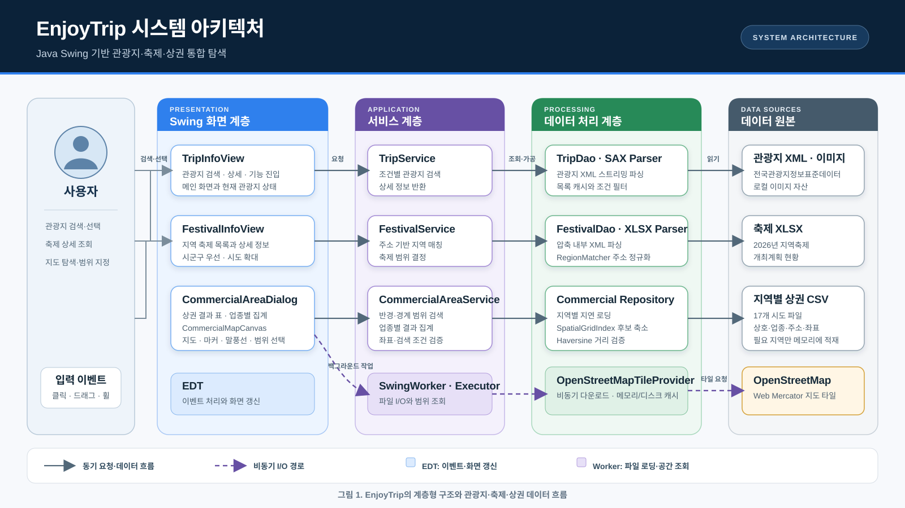
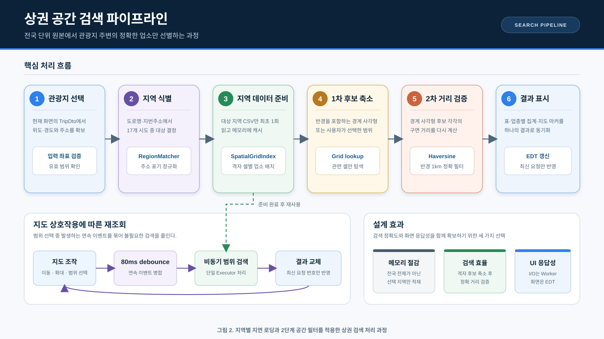

# EnjoyTrip

관광지를 검색하고, 선택한 관광지의 주변 축제와 상권을 한 화면에서 확인하는 Java Swing 애플리케이션입니다.

12팀 김강민, 김도연

## 주요 기능

| 기능 | 설명 |
| --- | --- |
| 관광지 조회 | 관광지명 또는 주소로 목록을 검색하고 이미지, 주소, 좌표, 전화번호, 소개를 확인합니다. |
| 주변 축제 조회 | 선택한 관광지의 시도·시군구를 기준으로 2026년 축제를 찾고 일정과 장소, 예산, 연락처 등 상세 정보를 보여줍니다. |
| 주변 상권 조회 | 관광지 반경 1km 또는 사용자가 지도에서 지정한 범위의 업소를 검색합니다. |
| 지도 탐색 | OpenStreetMap을 바탕으로 이동·확대·축소·범위 선택을 지원합니다. |
| 마커 상세 정보 | 상권 마커에 마우스를 올리면 상호명, 업종, 주소를 말풍선으로 표시합니다. 가까운 마커는 묶어서 개수를 표시합니다. |

## 실행 화면

### 관광지 검색과 상세 정보



오른쪽 목록에서 관광지를 선택하면 왼쪽에 사진과 상세 정보가 표시됩니다. 검색 조건은 관광지명과 주소 중에서 고를 수 있으며, 선택한 관광지를 기준으로 하단의 `주변 축제 검색`, `주변상권 검색` 기능이 이어집니다.

### 주변 축제



정방폭포를 선택한 뒤 주변 축제를 조회한 화면입니다. 관광지와 같은 시군구의 축제를 먼저 찾고, 결과가 없으면 시도 전체로 범위를 넓힙니다. 오른쪽 목록에서 축제를 선택하면 왼쪽 상세 영역이 함께 바뀝니다.

### 주변 상권과 지도



정방폭포 중심 반경 1km의 상권을 조회한 화면입니다. 지도에는 관광지 위치, 상권 마커, 조회 반경이 함께 표시됩니다. 마커에 마우스를 올리면 해당 위치의 상호명과 업종, 주소를 확인할 수 있고, 오른쪽에서는 전체 결과와 업종별 개수를 볼 수 있습니다.

상권 화면 조작 방법은 다음과 같습니다.

- `지도 이동`: 드래그로 지도를 이동하고 마우스 휠로 확대하거나 축소합니다.
- `범위 선택`: 지도 위에서 사각형을 그려 그 안의 상권만 다시 조회합니다.
- `반경 1km로 초기화`: 관광지 중심의 기본 조회 범위로 돌아갑니다.
- 마커에 마우스를 올리면 해당 업소 정보가 말풍선으로 나타납니다.

## 시스템 설계

### 전체 아키텍처

[](./EnjoyTrip/docs/diagrams/system-architecture.svg)

화면, 서비스, 데이터 처리, 원본 데이터의 네 계층을 분리했습니다. 관광지·축제·상권은 같은 요청 흐름을 따르지만 각 데이터 형식에 맞는 파서와 검색 방식을 사용합니다. 실선은 내부 요청과 데이터 흐름, 점선은 지도 타일과 파일 조회처럼 백그라운드에서 처리하는 I/O 경로를 뜻합니다.

화면 이벤트와 결과 반영은 EDT에서 처리하고, 파일 로딩과 상권 범위 검색은 `SwingWorker`와 단일 `Executor`로 분리했습니다. 이 경계를 통해 대용량 지역 CSV를 읽는 동안에도 화면 조작이 멈추지 않게 했습니다.

### 상권 공간 검색 파이프라인

[](./EnjoyTrip/docs/diagrams/commercial-search-pipeline.svg)

전국 상권 파일을 모두 적재하지 않고 관광지가 속한 지역의 CSV만 최초 1회 읽습니다. 로딩한 업소는 `SpatialGridIndex`에 배치하고, 검색할 때는 경계 사각형으로 후보를 먼저 줄인 뒤 Haversine 거리로 반경 1km 안의 업소를 다시 검증합니다.

지도에서 범위를 드래그하는 동안 발생하는 연속 이벤트는 80ms 단위로 모아 처리합니다. 범위 검색 결과에는 요청 번호를 붙여 가장 최근 요청만 표와 지도에 반영합니다.

### 프로젝트 구성

```text
EnjoyTrip
├─ src/com/ssafy/trip
│  ├─ model
│  │  ├─ dao          관광지·축제 데이터 접근
│  │  ├─ dto          화면과 서비스 사이의 데이터 객체
│  │  ├─ repository   상권 데이터 로딩과 공간 인덱스 관리
│  │  └─ service      검색 조건과 결과 가공
│  ├─ util            SAX, XLSX, CSV 파싱과 거리 계산
│  ├─ view            관광지·축제 Swing 화면
│  └─ view/commercial 지도, 마커, 말풍선, 범위 선택 화면
├─ img                 관광지 이미지
└─ res                 관광지·축제·상권 원본 데이터
```

## 구현 내용

### 관광지와 축제

- 관광지 XML은 SAX 방식으로 읽어 목록과 상세 정보를 구성합니다.
- 축제 XLSX는 별도 라이브러리 없이 압축 파일 내부의 XML을 읽어 파싱합니다.
- 주소를 시도와 시군구로 정규화해 현재 관광지와 같은 지역의 축제를 연결합니다.
- 실행 위치가 달라도 `ProjectResourceLocator`가 프로젝트의 `res`, `img` 경로를 찾습니다.

### 상권 검색

- 전국 데이터를 한 번에 메모리에 올리지 않고 선택한 관광지가 속한 지역의 CSV만 필요할 때 읽습니다.
- 지역별 데이터는 `SpatialGridIndex`에 저장해 지도 범위 안의 후보만 빠르게 찾습니다.
- 반경 검색은 사각 경계로 후보를 줄인 뒤 Haversine 거리 계산으로 1km 안의 결과를 다시 확인합니다.
- 파일 로딩과 조회는 백그라운드에서 처리하고 Swing 화면 갱신은 EDT에서 수행합니다.
- 범위 선택 중에는 짧은 지연을 두어 드래그 이벤트마다 중복 조회가 발생하지 않게 했습니다.

### 지도

- OpenStreetMap 타일과 같은 Web Mercator 좌표계를 사용해 지도와 마커 위치를 맞춥니다.
- 지도 타일은 비동기로 내려받고 메모리와 임시 디렉터리에 캐시합니다.
- 인터넷 연결이 없거나 타일을 불러오는 중에는 좌표 격자를 대신 표시합니다.
- 가까운 마커는 하나로 묶고, 마우스 위치에 따라 겹치지 않는 말풍선을 그립니다.

## 실행 방법

### Eclipse

1. 저장소의 `EnjoyTrip` 폴더를 `Existing Projects into Workspace`로 가져옵니다.
2. 프로젝트 JRE가 Java 8 이상인지 확인합니다.
3. `src/com/ssafy/trip/Main.java`를 `Run As > Java Application`으로 실행합니다.

### PowerShell

```powershell
cd EnjoyTrip
New-Item -ItemType Directory -Force out | Out-Null
$sourceFiles = Get-ChildItem -Recurse -Filter *.java src | ForEach-Object FullName
javac -encoding UTF-8 -d out $sourceFiles
java -cp out com.ssafy.trip.Main
```

상권 지도를 표시하려면 인터넷 연결이 필요합니다. 최초 상권 조회 시 선택한 지역의 CSV를 읽기 때문에 파일 크기에 따라 잠시 시간이 걸릴 수 있습니다.

## 데이터

- 관광지: 전국관광지정보표준데이터
- 축제: 2026년 지역축제 개최계획 현황
- 상권: 소상공인시장진흥공단 상가(상권)정보
- 지도: [OpenStreetMap](https://www.openstreetmap.org/copyright)

원본 데이터 파일은 `EnjoyTrip/res`에 있으며, 지도 화면의 OpenStreetMap 저작자 표시는 프로그램 안에서도 확인할 수 있습니다.

## 클래스 다이어그램

```mermaid
classDiagram
    direction TB

    class Main {
        +main(String[] args) void
    }

    class TripInfoView {
        -TripService tripService
        -CommercialAreaService commercialAreaService
        -TripDto curTrip
        +setMain() void
        +showTrips() void
        +openCommercialAreaView() void
    }

    class FestivalInfoView {
        -FestivalService festivalService
        -TripDto trip
        -FestivalSearchResult searchResult
    }

    class CommercialAreaDialog
    class CommercialAreaPanel {
        -TripDto trip
        -CommercialAreaService service
        -CommercialMapCanvas mapCanvas
        +disposeResources() void
    }

    class CommercialMapCanvas {
        -List~CommercialAreaDto~ stores
        +setStores(List~CommercialAreaDto~ stores) void
        +getVisibleBounds() MapBounds
        +resetViewToRadius(double radius) void
    }

    class CommercialMarkerPainter
    class MarkerTooltipPainter
    class RangeSelectionPainter
    class OpenStreetMapTileProvider

    class TripService {
        <<interface>>
        +searchAll(TripSearchDto condition) List~TripDto~
        +search(int num) TripDto
    }

    class TripServiceImpl {
        -TripDao tripDao
    }

    class FestivalService {
        <<interface>>
        +searchNearby(TripDto trip) FestivalSearchResult
        +count() int
    }

    class FestivalServiceImpl {
        -FestivalDao festivalDao
    }

    class CommercialAreaService {
        <<interface>>
        +prepare(TripDto trip) void
        +searchRadius(TripDto trip, double radiusMeters) CommercialAreaSearchResult
        +searchBounds(TripDto trip, MapBounds bounds) CommercialAreaSearchResult
        +getLoadedRegionCount() int
    }

    class CommercialAreaServiceImpl {
        -CommercialAreaRepository repository
    }

    class TripDao {
        <<interface>>
        +loadData() void
        +searchAll(TripSearchDto condition) List~TripDto~
        +search(int num) TripDto
    }

    class TripDaoImpl {
        -List~TripDto~ tripInfo
    }

    class FestivalDao {
        <<interface>>
        +searchBySido(String sido) List~FestivalDto~
        +count() int
    }

    class FestivalDaoImpl {
        -List~FestivalDto~ festivals
    }

    class CommercialAreaRepository {
        <<interface>>
        +prepare(TripDto trip) void
        +findWithin(TripDto trip, MapBounds bounds) List~CommercialAreaDto~
        +getLoadedRegionCount() int
    }

    class CommercialAreaRepositoryImpl {
        -CommercialAreaFileLoader loader
        -Map~String, FutureTask~ regionIndexes
    }

    class SpatialGridIndex {
        +add(CommercialAreaDto store) void
        +query(MapBounds bounds) List~CommercialAreaDto~
    }

    class TouristDestinationSAXParser
    class FestivalExcelParser
    class CommercialAreaFileLoader
    class RegionMatcher
    class DistanceCalculator

    class TripDto {
        -int num
        -String touristDestination
        -String streetAddress
        -double lat
        -double lng
    }

    class TripSearchDto {
        -String touristDestination
        -String sido
    }

    class FestivalDto {
        -int num
        -String festivalName
        -String sido
        -String sigungu
        -LocalDate startDate
        -LocalDate endDate
    }

    class FestivalSearchResult {
        -List~FestivalDto~ festivals
        -String searchArea
        -boolean districtMatched
    }

    class CommercialAreaDto {
        -String id
        -String name
        -String largeCategory
        -String roadAddress
        -double latitude
        -double longitude
    }

    class CommercialAreaSearchResult {
        -List~CommercialAreaDto~ stores
        -Map~String, Integer~ categoryCounts
    }

    class MapBounds {
        -double minLatitude
        -double minLongitude
        -double maxLatitude
        -double maxLongitude
    }

    Main --> TripInfoView : starts
    TripInfoView --> TripService : searches trips
    TripInfoView --> FestivalInfoView : opens
    TripInfoView --> CommercialAreaDialog : opens
    TripInfoView --> CommercialAreaService : searches stores
    TripInfoView --> TripDto : selects
    TripInfoView --> TripSearchDto : creates

    FestivalInfoView --> FestivalService : searches festivals
    FestivalInfoView --> TripDto : search origin
    FestivalInfoView --> FestivalSearchResult : displays

    CommercialAreaDialog *-- CommercialAreaPanel
    CommercialAreaPanel *-- CommercialMapCanvas
    CommercialAreaPanel --> CommercialAreaService
    CommercialAreaPanel --> CommercialAreaSearchResult : displays
    CommercialMapCanvas *-- CommercialMarkerPainter
    CommercialMapCanvas *-- MarkerTooltipPainter
    CommercialMapCanvas *-- RangeSelectionPainter
    CommercialMapCanvas --> OpenStreetMapTileProvider
    CommercialMapCanvas --> MapBounds : creates
    CommercialMapCanvas --> CommercialAreaDto : renders

    TripServiceImpl ..|> TripService
    TripServiceImpl --> TripDao
    TripDaoImpl ..|> TripDao
    TripDaoImpl --> TouristDestinationSAXParser : loads XML
    TripDaoImpl o-- TripDto
    TripService --> TripSearchDto
    TripService --> TripDto

    FestivalServiceImpl ..|> FestivalService
    FestivalServiceImpl --> FestivalDao
    FestivalServiceImpl --> RegionMatcher
    FestivalDaoImpl ..|> FestivalDao
    FestivalDaoImpl --> FestivalExcelParser : loads XLSX
    FestivalDaoImpl o-- FestivalDto
    FestivalSearchResult *-- FestivalDto

    CommercialAreaServiceImpl ..|> CommercialAreaService
    CommercialAreaServiceImpl --> CommercialAreaRepository
    CommercialAreaServiceImpl --> DistanceCalculator
    CommercialAreaServiceImpl --> CommercialAreaSearchResult : creates
    CommercialAreaRepositoryImpl ..|> CommercialAreaRepository
    CommercialAreaRepositoryImpl --> CommercialAreaFileLoader : loads CSV
    CommercialAreaRepositoryImpl o-- SpatialGridIndex : caches by region
    SpatialGridIndex o-- CommercialAreaDto : indexes
    SpatialGridIndex --> MapBounds : queries
    CommercialAreaSearchResult *-- CommercialAreaDto
```


